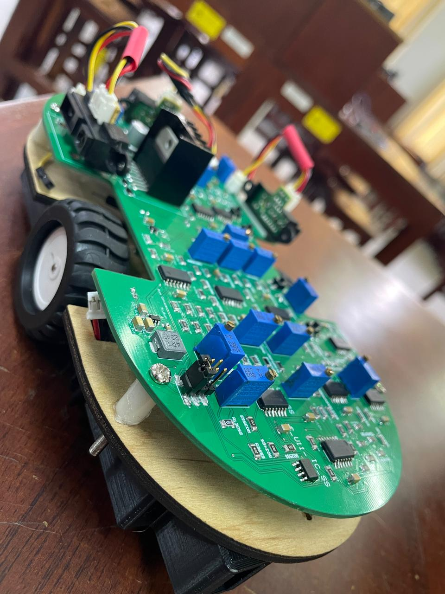

  

###

<h1 align="center">hey there 👋 I am Ruchira Abeywardhane</h1>

###

<h3 align="left">👩‍💻  About Me</h3>

###

I'm ... from ....  🔭 I’m an Electronic and Telecommunication Undergraduate at the University of Moratuwa Sri Lanka.  📚 I'm learning Robotics, Digital System Design, Embedded systems, and Machine Vision.

###

<h3 align="left">🛠 Language and tools</h3>

###

  
  
  
  
  
  
  
  
  

###

<h3 align="left">🔥   My Stats :</h3>

###

  

###
